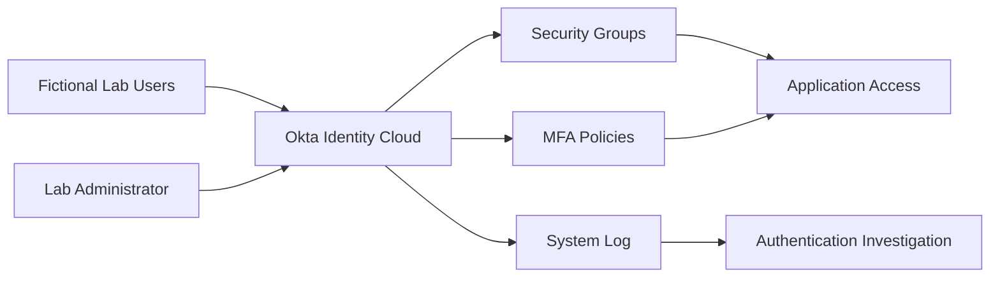

# Building an Okta Identity Security Lab


[](https://www.okta.com/)
[](#project-overview)
[](#security-controls)
[](#project-roadmap)
[](#security-and-privacy)

> A hands-on identity and access management lab covering user lifecycle administration, group-based access control, multi-factor authentication, and authentication-event monitoring with Okta.

## Project Overview

Identity has become a critical security boundary for modern organisations. As businesses rely on cloud applications, remote access, and distributed workforces, attackers increasingly target user accounts. Weak passwords, excessive permissions, and insufficient authentication monitoring can allow compromised identities to remain undetected.

This project documents the construction of an **Okta Identity Security Lab** using fictional users and groups in a controlled environment. The lab is designed to develop practical skills relevant to identity administrators, system administrators, cloud engineers, and security analysts.

## Objectives

- Create and secure an Okta Integrator Free Plan tenant.
- Implement a professional user and group naming convention.
- Practise user onboarding, profile updates, suspension, and deactivation.
- Apply group-based access control and least-privilege principles.
- Configure and test multi-factor authentication.
- Generate successful and failed authentication events.
- Investigate sign-in activity in the Okta System Log.
- Document evidence without exposing credentials or sensitive tenant information.

## Lab Architecture



## Tools and Technologies

| Technology | Purpose |
|---|---|
| Okta Integrator Free Plan | Non-production IAM tenant |
| Okta Universal Directory | User and profile administration |
| Okta Groups | Group-based access control |
| Okta Verify / supported authenticator | Multi-factor authentication |
| Okta System Log | Authentication monitoring and investigation |
| Web browser | Administrative and user testing |
| GitHub | Technical documentation and evidence tracking |

## Verified Achievements

- [x] Registered an Okta Integrator Free Plan tenant.
- [x] Verified the administrator email address.
- [x] Created a strong administrator password.
- [x] Configured the required administrator authenticator.
- [x] Accessed the Okta Admin Console.
- [x] Recorded the organisation URL privately rather than publishing it.
- [x] Established a safe, fictional-data-only approach for the lab.
- [x] Configured the organisation display name.
- [x] Created three fictional lab users.
- [x] Completed first sign-in, password change, and Okta Verify enrolment for a test user.
- [ ] Create professional security groups.
- [ ] Apply group-based application assignments.
- [ ] Enforce and test organisation-level MFA policies.
- [ ] Generate successful and failed authentication events.
- [ ] Investigate events in the Okta System Log.
- [ ] Document incident findings and remediation recommendations.

## Phase 1: Create the Okta Tenant

### 1. Register for the Integrator Free Plan

Open the official [Okta Integrator Free Plan signup page](https://developer.okta.com/signup/) and complete the registration form using an authorised lab email account.


### 2. Verify and activate the administrator account

Open the verification message sent by Okta and select **Activate account**.


### 3. Secure the administrator account

Create a unique, strong administrator password and configure the requested authenticator. Store the tenant URL privately; it normally follows a format similar to:

```text
https://integrator-<unique-id>.okta.com
```


> **Important:** The Okta Integrator Free Plan is intended for development and testing—not production. Plan limits and inactivity rules can change, so confirm the current conditions in Okta's official documentation.

## Phase 2: Configure the Organisation Name

After securing the tenant, I configured a professional organisation display name to make the lab easier to identify and administer.

From the **Okta Admin Console**:

1. Select **Settings** from the left navigation menu.
2. Select **Account**.
3. Locate the **Organization Contact** section and click **Edit**.
4. Enter the required organisation name in the **Company name** field.
5. Review the remaining organisation details.
6. Scroll down and click **Save**.


### Validation

After saving the change, I confirmed that the updated organisation name appeared in the account information. This change updates the organisation's display information; it does not necessarily rename the Okta tenant URL or its permanent technical identifier.

### Security consideration

Before publishing evidence, I reviewed the screenshot and removed or obscured any administrator email address, complete tenant URL, personal information, recovery data, or other sensitive account details.

## Phase 3: Create Three Fictional Users and Enrol MFA

This phase demonstrates the joiner portion of the identity lifecycle: creating controlled test identities, activating a user account, replacing the temporary password, and enrolling an authenticator for multi-factor authentication.

### 1. Create the first fictional user

From the **Okta Admin Console**:

1. Navigate to **Directory → People**.
2. Click **Add person**.
3. Enter the fictional user's profile information.
4. Select **Activate now**.
5. Set a unique temporary password.
6. Require the user to change the password during the first sign-in.
7. Save the account.


I repeated the process to create three fictional users representing different organisational roles:

| User | Lab role | Purpose |
|---|---|---|
| Alice Analyst | Security analyst | Tests analyst access and MFA |
| Bob Support | Technical support | Tests support-team access |
| Carol Contractor | Contractor | Tests restricted and temporary access |

### 2. Perform the first user sign-in

To avoid mixing the administrator and end-user sessions, I opened a private browser window and visited the tenant's end-user dashboard. The tenant-specific URL was kept private.

The user entered the username supplied by the administrator.


The user then entered the temporary password.


### 3. Replace the temporary password

At first sign-in, Okta required the user to replace the temporary password with a unique, strong password.


### 4. Enrol Okta Verify

The user installed the official **Okta Verify** mobile application and selected the option to add an account. In the application, the user:

1. Selected the **plus (+)** icon.
2. Chose **Organization** or **Work or school**, depending on the version displayed.
3. Continued to the QR-code scanner.
4. Selected **Yes, ready to scan**.
5. Scanned the QR code displayed in the browser.
6. Completed the verification challenge.


Alice successfully completed the first sign-in and enrolled Okta Verify as an MFA factor.


### 5. Validate the result

After the users completed their first sign-in and changed their temporary passwords, their status changed from **Password expired** to **Active** in **Directory → People**.


### Outcome

- Three fictional user identities were created.
- Temporary credentials were replaced during first sign-in.
- A test user successfully enrolled Okta Verify.
- The user account became active.
- The process produced evidence for user onboarding and MFA enrolment.

> **Security note:** Temporary passwords must be transmitted securely and changed immediately. Passwords, QR codes, activation links, tenant identifiers, administrator details, and recovery information must never be published in screenshots or committed to this repository.

## Security Controls

The completed lab will demonstrate:

- Strong administrator authentication
- Multi-factor authentication
- Least-privilege access
- Group-based authorisation
- User lifecycle controls
- Successful and failed sign-in monitoring
- Authentication-event investigation
- Secure documentation and evidence sanitisation

## Security and Privacy

This repository is strictly for a controlled, non-production lab.

- All users, groups, applications, and events must be fictional or intentionally generated.
- Do not commit passwords, recovery codes, API tokens, session cookies, tenant secrets, or administrator email addresses.
- Redact the unique Okta organisation URL from public screenshots.
- Review screenshots for names, browser tabs, notifications, and personal information before publishing.
- Never test authentication controls against systems or accounts without authorisation.

## Project Roadmap

| Phase | Activity | Status |
|---|---|---|
| 1 | Create and secure the Okta tenant | Complete |
| 2 | Configure the organisation display name | Complete |
| 3 | Create three fictional users and enrol Okta Verify | Complete |
| 4 | Create professional security groups | Planned |
| 5 | Configure group-based application access | Planned |
| 6 | Configure and test organisation-level MFA policies | Planned |
| 7 | Generate successful and failed sign-ins | Planned |
| 8 | Investigate authentication events | Planned |
| 9 | Document findings and lessons learned | Planned |
| 10 | Optional Active Directory integration | Future enhancement |

## Skills Demonstrated

- Identity and Access Management
- Okta administration
- User lifecycle management
- Role- and group-based access control
- Multi-factor authentication
- Authentication monitoring
- Security-event investigation
- Least-privilege design
- Technical documentation

## Evidence Standard

Each completed phase should include:

1. The objective and security rationale.
2. Sanitised configuration screenshots.
3. The test performed.
4. The expected and actual result.
5. Any troubleshooting undertaken.
6. The security lesson learned.

## Author

**Arize Onubiyi**  
Cloud, Identity and Cybersecurity Professional  
[GitHub](https://github.com/Arizetbest)

## Disclaimer

This project is an independent educational lab. It is not affiliated with, endorsed by, or sponsored by Okta. Product names and trademarks belong to their respective owners.

## License

This repository is provided for educational and portfolio purposes. Review the repository's licence before reusing the material.
