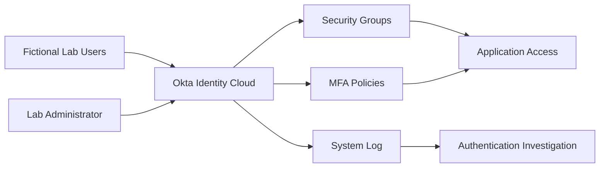

# Building an Okta Identity Security Lab


[](https://www.okta.com/)
[](#project-overview)
[](#security-controls)
[](#project-roadmap)
[](#security-and-privacy)

> A hands-on identity and access management lab covering user lifecycle administration, group-based access control, multi-factor authentication, and authentication-event monitoring with Okta.

## Project Overview

Identity has become a critical security boundary for modern organisations. As businesses rely on cloud applications, remote access, and distributed workforces, attackers increasingly target user accounts. Weak passwords, excessive permissions, and insufficient authentication monitoring can allow compromised identities to remain undetected.

This project documents the construction of an **Okta Identity Security Lab** using fictional users and groups in a controlled environment. The lab is designed to develop practical skills relevant to identity administrators, system administrators, cloud engineers, and security analysts.

## Objectives

- Create and secure an Okta Integrator Free Plan tenant.
- Implement a professional user and group naming convention.
- Practise user onboarding, profile updates, suspension, and deactivation.
- Apply group-based access control and least-privilege principles.
- Configure and test multi-factor authentication.
- Generate successful and failed authentication events.
- Investigate sign-in activity in the Okta System Log.
- Document evidence without exposing credentials or sensitive tenant information.

## Lab Architecture



## Tools and Technologies

| Technology | Purpose |
|---|---|
| Okta Integrator Free Plan | Non-production IAM tenant |
| Okta Universal Directory | User and profile administration |
| Okta Groups | Group-based access control |
| Okta Verify / supported authenticator | Multi-factor authentication |
| Okta System Log | Authentication monitoring and investigation |
| Web browser | Administrative and user testing |
| GitHub | Technical documentation and evidence tracking |

## Verified Achievements

- [x] Registered an Okta Integrator Free Plan tenant.
- [x] Verified the administrator email address.
- [x] Created a strong administrator password.
- [x] Configured the required administrator authenticator.
- [x] Accessed the Okta Admin Console.
- [x] Recorded the organisation URL privately rather than publishing it.
- [x] Established a safe, fictional-data-only approach for the lab.
- [x] Configured the organisation display name.
- [x] Created three fictional lab users.
- [x] Completed first sign-in, password change, and Okta Verify enrolment for a test user.
- [x] Created four professionally named lab groups.
- [x] Assigned fictional users to the appropriate groups and validated membership.
- [x] Enabled Okta Verify as an authenticator.
- [x] Created and validated an MFA enrolment policy and rule.
- [x] Created a Global Session Policy requiring MFA for the SOC Analysts group.
- [x] Added and validated the MFA authentication rule.
- [x] Enrolled Alice Analyst in Okta Verify and validated MFA registration.
- [x] Confirmed the test user's account changed to Active.
- [ ] Apply group-based application assignments.
- [ ] Generate successful and failed authentication events.
- [ ] Investigate events in the Okta System Log.
- [ ] Document incident findings and remediation recommendations.

## Phase 1: Create the Okta Tenant

### 1. Register for the Integrator Free Plan

Open the official [Okta Integrator Free Plan signup page](https://developer.okta.com/signup/) and complete the registration form using an authorised lab email account.


### 2. Verify and activate the administrator account

Open the verification message sent by Okta and select **Activate account**.


### 3. Secure the administrator account

Create a unique, strong administrator password and configure the requested authenticator. Store the tenant URL privately; it normally follows a format similar to:

```text
https://integrator-<unique-id>.okta.com
```


> **Important:** The Okta Integrator Free Plan is intended for development and testing—not production. Plan limits and inactivity rules can change, so confirm the current conditions in Okta's official documentation.

## Phase 2: Configure the Organisation Name

After securing the tenant, I configured a professional organisation display name to make the lab easier to identify and administer.

From the **Okta Admin Console**:

1. Select **Settings** from the left navigation menu.
2. Select **Account**.
3. Locate the **Organization Contact** section and click **Edit**.
4. Enter the required organisation name in the **Company name** field.
5. Review the remaining organisation details.
6. Scroll down and click **Save**.


### Validation

After saving the change, I confirmed that the updated organisation name appeared in the account information. This change updates the organisation's display information; it does not necessarily rename the Okta tenant URL or its permanent technical identifier.

### Security consideration

Before publishing evidence, I reviewed the screenshot and removed or obscured any administrator email address, complete tenant URL, personal information, recovery data, or other sensitive account details.

## Phase 3: Create Three Fictional Users and Enrol MFA

This phase demonstrates the joiner portion of the identity lifecycle: creating controlled test identities, activating a user account, replacing the temporary password, and enrolling an authenticator for multi-factor authentication.

### 1. Create the first fictional user

From the **Okta Admin Console**:

1. Navigate to **Directory → People**.
2. Click **Add person**.
3. Enter the fictional user's profile information.
4. Select **Activate now**.
5. Set a unique temporary password.
6. Require the user to change the password during the first sign-in.
7. Save the account.


I repeated the process to create three fictional users representing different organisational roles:

| User | Lab role | Purpose |
|---|---|---|
| Alice Analyst | Security analyst | Tests analyst access and MFA |
| Bob Support | Technical support | Tests support-team access |
| Carol Contractor | Contractor | Tests restricted and temporary access |

### 2. Perform the first user sign-in

To avoid mixing the administrator and end-user sessions, I opened a private browser window and visited the tenant's end-user dashboard. The tenant-specific URL was kept private.

The user entered the username supplied by the administrator.


The user then entered the temporary password.


### 3. Replace the temporary password

At first sign-in, Okta required the user to replace the temporary password with a unique, strong password.


### 4. Enrol Okta Verify

The user installed the official **Okta Verify** mobile application and selected the option to add an account. In the application, the user:

1. Selected the **plus (+)** icon.
2. Chose **Organization** or **Work or school**, depending on the version displayed.
3. Continued to the QR-code scanner.
4. Selected **Yes, ready to scan**.
5. Scanned the QR code displayed in the browser.
6. Completed the verification challenge.


Alice successfully completed the first sign-in and enrolled Okta Verify as an MFA factor.


### 5. Validate the result

After the users completed their first sign-in and changed their temporary passwords, their status changed from **Password expired** to **Active** in **Directory → People**.


### Outcome

- Three fictional user identities were created.
- Temporary credentials were replaced during first sign-in.
- A test user successfully enrolled Okta Verify.
- The user account became active.
- The process produced evidence for user onboarding and MFA enrolment.

> **Security note:** Temporary passwords must be transmitted securely and changed immediately. Passwords, QR codes, activation links, tenant identifiers, administrator details, and recovery information must never be published in screenshots or committed to this repository.

## Phase 4: Create the Lab Groups and Assign Membership

This phase establishes group-based identity administration. Groups make it possible to manage access consistently by assigning users to roles rather than granting permissions and applications directly to individual accounts.

### 1. Create the general lab users group

From the **Okta Admin Console**:

1. Navigate to **Directory → Groups**.
2. Click **Add group**.
3. Enter the professional group name and description.
4. Save the group.


I repeated the same procedure until all four lab groups had been created. I then returned to **Directory → Groups** to confirm that every group appeared in the directory.


### 2. Assign group membership

To place a fictional user in the correct role-based group:

1. Open the required group.
2. Select **Assign people**.
3. Search for the relevant fictional test user.
4. Select the **plus (+)** icon beside the user.
5. Click **Done** to save the assignment.

For the contractor access scenario, I opened **GRP-OKTA-CONTRACTORS**.


I selected **Assign people** and used the plus icon to add the appropriate fictional contractor account.


### 3. Validate the membership

After saving the assignment, I reopened the group and confirmed that the selected user appeared in its membership list.


### Outcome

- Four lab groups were created successfully.
- A consistent professional naming convention was used.
- Fictional users were assigned to the groups relevant to their job functions.
- Membership was validated from the group details page.
- The lab is ready for group-based application assignment and access testing.

> **Security note:** Group membership should follow least-privilege and need-to-know principles. Access should be reviewed whenever a user joins, changes role, or leaves the organisation. Public evidence must not expose real identities, tenant identifiers, email addresses, credentials, or sensitive application assignments.

## Phase 5: Enable Okta Verify and Configure MFA Enrolment

This phase strengthens account security by enabling **Okta Verify** and applying an authenticator enrolment policy. The policy determines which users must enrol an authentication factor, while its rule defines when and how the requirement is applied.

### 1. Enable Okta Verify

From the **Okta Admin Console**:

1. Navigate to **Security → Authenticators**.
2. Click **Add authenticator**.
3. Select **Okta Verify**.
4. Review the available configuration options.
5. Add and activate the authenticator.


### 2. Create the MFA enrolment policy

I created an authenticator enrolment policy to define the lab users covered by the MFA requirement.


To add the policy:

1. Open the authenticator enrolment policies.
2. Click **Add a policy**.
3. Enter a clear policy name and description.
4. Assign the intended lab groups or users.
5. Configure Okta Verify as required.
6. Save the policy.


### 3. Add the policy rule

I added a rule to specify the conditions under which users must enrol in Okta Verify.

1. Open the newly created policy.
2. Click **Add rule**.
3. Enter a descriptive rule name.
4. Configure the user and enrolment conditions required for the lab.
5. Set the permitted grace period and actions.
6. Save the rule.


### 4. Validate the configuration

After saving the rule, I returned to the policy page and confirmed that the new rule was active and correctly positioned within the policy.


### Outcome

- Okta Verify was enabled as an available authenticator.
- An MFA enrolment policy was created for the intended lab scope.
- A policy rule was added and activated.
- The configuration was validated from the Admin Console.
- The lab is ready for controlled MFA sign-in testing and authentication-event monitoring.

> **Security note:** MFA policies should be tested with fictional pilot users before wider enforcement. Maintain a protected administrator recovery method, avoid excluding users without a documented reason, and never publish QR codes, recovery codes, credentials, tenant identifiers, or personal account information.

## Phase 6: Require MFA During Authentication

Authenticator enrolment makes Okta Verify available to users, but it does not by itself determine when users must prove their identity with MFA. In this phase, I created a **Global Session Policy** and rule that require MFA during authentication for the SOC Analysts group.

### 1. Open Global Session Policy

From the **Okta Admin Console**:

1. Navigate to **Security → Global Session Policy**.
2. Click **Add policy**.


### 2. Add the group-scoped policy

I created a policy for the SOC Analysts group using a professional name and description, then assigned the relevant group.

This policy applies secure sign-in and session requirements to the SOC Analysts group, strengthening identity protection and access control.


### 3. Create the MFA rule

Within the new policy, I created a clearly named rule to define its authentication and session conditions.


The rule was configured to require multi-factor authentication for users covered by the policy. Session and reauthentication settings were selected to balance security with a practical lab user experience.


### 4. Validate the policy

After saving the rule, I returned to the Global Session Policy page and confirmed that the policy and its MFA rule were active in the Admin Console.


### Outcome

- A dedicated Global Session Policy was created.
- The policy was scoped to the SOC Analysts group.
- An MFA authentication rule was configured and activated.
- The completed configuration was verified from the Admin Console.
- Okta Verify can now be requested during authentication for users covered by the policy.

> **Security note:** Policy order affects evaluation in Okta. A specific group-based policy should be positioned appropriately above broader policies and tested with fictional accounts before wider enforcement. Maintain a protected recovery method to prevent administrator lockout.

## Phase 7: Enrol Alice Analyst in MFA

With the authenticator, enrolment policy, and Global Session Policy configured, I tested the end-user experience by enrolling the fictional user **Alice Analyst** in Okta Verify. This validates that the administrative controls created in Phases 5 and 6 operate as expected for a user in scope.

### 1. Prepare the authenticator

Alice installed the official **Okta Verify** application on a mobile device. The test was performed using only the fictional lab account and a private browser session.

### 2. Sign in with the fictional account

Alice opened the Okta end-user sign-in page and entered the username provided by the lab administrator.


She then entered the temporary password securely supplied by the administrator.


### 3. Replace the temporary password

During the first sign-in, Okta required Alice to replace the temporary password with a unique, strong password.


### 4. Enrol Okta Verify

When prompted to set up security methods, Alice selected **Okta Verify**.


In the Okta Verify mobile application, Alice:

1. Selected the **plus (+)** icon.
2. Chose **Organization** or **Work or school**, depending on the application version.
3. Continued to the QR-code scanner.
4. Selected **Yes, ready to scan**.
5. Scanned the QR code displayed in the browser.
6. Completed the verification challenge.

Alice successfully signed in and registered Okta Verify as an MFA factor.


### 5. Validate the account status

After Alice completed the first sign-in, changed the temporary password, and enrolled in MFA, I returned to **Directory → People**. Her account status had changed to **Active**, confirming successful activation.


### Outcome

- Alice authenticated using her fictional lab identity.
- The temporary password was replaced successfully.
- Okta Verify was registered as an MFA factor.
- The configured policies presented the expected enrolment experience.
- Alice's account status changed to Active.
- The lab is ready for successful and failed authentication testing.

> **Security note:** QR codes, temporary passwords, recovery codes, activation links, and authentication prompts may contain sensitive information. They must be obscured in public evidence. MFA enrolment should be performed by the account owner using a trusted device.

## Security Controls

The completed lab will demonstrate:

- Strong administrator authentication
- Multi-factor authentication
- Least-privilege access
- Group-based authorisation
- User lifecycle controls
- Successful and failed sign-in monitoring
- Authentication-event investigation
- Secure documentation and evidence sanitisation

## Security and Privacy

This repository is strictly for a controlled, non-production lab.

- All users, groups, applications, and events must be fictional or intentionally generated.
- Do not commit passwords, recovery codes, API tokens, session cookies, tenant secrets, or administrator email addresses.
- Redact the unique Okta organisation URL from public screenshots.
- Review screenshots for names, browser tabs, notifications, and personal information before publishing.
- Never test authentication controls against systems or accounts without authorisation.

## Project Roadmap

| Phase | Activity | Status |
|---|---|---|
| 1 | Create and secure the Okta tenant | Complete |
| 2 | Configure the organisation display name | Complete |
| 3 | Create three fictional users and enrol Okta Verify | Complete |
| 4 | Create lab groups and assign user membership | Complete |
| 5 | Enable Okta Verify and configure MFA enrolment | Complete |
| 6 | Require MFA during authentication | Complete |
| 7 | Enrol Alice Analyst in Okta Verify and validate MFA | Complete |
| 8 | Configure group-based application access | Planned |
| 9 | Generate successful and failed sign-ins | Planned |
| 10 | Investigate authentication events | Planned |
| 11 | Document findings and lessons learned | Planned |
| 12 | Optional Active Directory integration | Future enhancement |

## Skills Demonstrated

- Identity and Access Management
- Okta administration
- User lifecycle management
- Role- and group-based access control
- Multi-factor authentication
- Authentication monitoring
- Security-event investigation
- Least-privilege design
- Technical documentation

## Evidence Standard

Each completed phase should include:

1. The objective and security rationale.
2. Sanitised configuration screenshots.
3. The test performed.
4. The expected and actual result.
5. Any troubleshooting undertaken.
6. The security lesson learned.

## Author

**Arize Onubiyi**  
Cloud, Identity and Cybersecurity Professional  
[GitHub](https://github.com/Arizetbest)

## Disclaimer

This project is an independent educational lab. It is not affiliated with, endorsed by, or sponsored by Okta. Product names and trademarks belong to their respective owners.

## License

This repository is provided for educational and portfolio purposes. Review the repository's licence before reusing the material.
